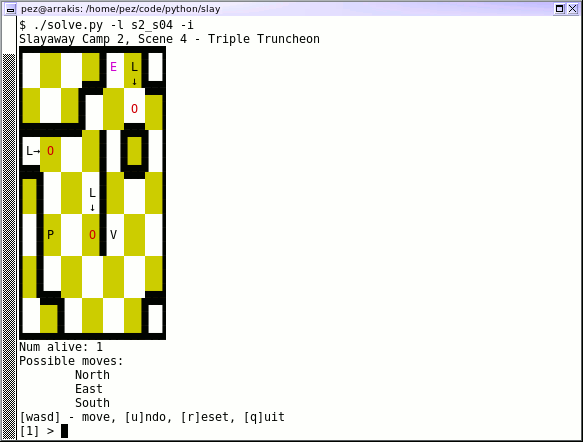

Slayaway Camp Bruteforce Solver
===============================

This is a bruteforce solver (and, completely incidentally, commandline
version of) the excellent puzzle game "Slayaway Camp", by Blue Wizard
Digital: http://store.steampowered.com/app/530390/Slayaway_Camp/

I believe I started on this when I got stuck on one of the "NC-17"
levels and figured I'd try my hand at writing a bruteforce solver for
the game.  Along the way I had so much fun putting it together that
it became a fully-fledged console version of the game, in addition to
having level definitions for basically the entire base game.

The console version certainly leaves quite a lot to be desired from
a UI perspective, since it's really only in there because I wanted a
way to easily test out functionality.  It'll look like this:

When run in non-interactive mode, you'll get output like this:

    $ ./solve.py -l s2_s04
    Winning moves (11) for Slayaway Camp 2, Scene 4 - Triple Truncheon:
            1. South
            2. East
            3. North
            4. West
            5. South
            6. South
            7. East
            8. North
            9. West
            10. South
            11. North
    $

The game has levels defined for all of the "main" Slayaway Camp levels
(ie: Slayaway Camp 1 through Slayaway Camp X), plus the NC-17 levels for
Slayaway Camp 1.

Usage
=====

Slayaway Solver was written in Python.  It's only ever been tested in Python 3,
though I'm not aware of anything I've done that'd prevent it from running
under Python 3.  By default, the shebang on the file will actually launch
PyPy3, for performance reasons, so PyPy3 is a requirement if you don't want
to specify an interpreter by hand on the CLI.

Slayaway Solver requires the `colorama` Python module, to make the interactive
output a little more palatable.  An easy way to get this installed for PyPy3
appropriately is using virtualenvs:

    $ pypy3 -m venv_slayaway
    $ . venv_slayaway/bin/activate
    (venv_slayaway) $ pip install colorama
    (venv_slayaway) $ ./solve.py

Commandline usage is pretty simple:

	usage: solve.py [-h] [-i | -t] [-l LEVELNAME]

	Play or solve Slayaway Camp levels

	optional arguments:
	  -h, --help            show this help message and exit
	  -i, --interactive     Run interactively rather than in solver mode (default:
							False)
	  -t, --test            Generate python code suitable for a unit test
							(default: False)
	  -l LEVELNAME, --level LEVELNAME
							Level name to run (use "list" to get a list) (default:
							s1_s01)

As mentioned, to get a list of all levels that it knows about, specify
`--level list` or `-l list` as an argument.

The `-t`/`--test` argument is mostly just for my own purposes to add it into
our unit test area.  They aren't actually real unit tests; rather it just checks
each level against previously-found solutions.

Performance
===========

This is a bruteforce solver, which means that we've got orders-of-magnitude
problems when dealing with solving more complex maps, especially when the
sticky gum/goo is encountered and our positioning possibilities shoot up.  Most
of the levels can be solved in quite reasonable time using the default CPython
implementation, but the app will currently launch using PyPy3 regardless.

A few levels *definitely* benefit from using PyPy3.  I'm not even sure how long
it takes to solve "Slayaway Camp X, Deleted Scene 4," using CPython, for instance.
If you compile Slayaway Solver using Cython, the solve time for that level goes
down to 24 minutes if you specify to return the first solution found, rather than
the most efficient one.  If you run it with PyPy3 instead, the solve time goes down to
about 5 minutes (if returning the first solution found), or 7 minutes total to find
the most efficient solution.  (That's on my CPU, of course - your mileage may vary.)
Presumably CPython could be optimized quite a bit by porting the code over, but
it's easier to just run it in PyPy3 instead.

Interactive Use
===============

The interactive UI for this definitely takes a bit of getting used to.  Your
available commands are just `n`, `e`, `w`, and `s` (for north, east, west, and
south).  You can also undo moves with `u`, reset to the initial state with `r`,
and quit with `q`.

The symbols used in the UI to indicate the map:

* `P` - Player
* `V` - Victim
* `E` - Exit
* `C` - Cat
* `L` - Police (will use `←↑→↓` to show which way they're facing)
* `S` - SWAT Cop (will use `←↑→↓` to show which way they're facing)
* `O` - Police targeting reticle
* `H` - Hazard (pit, fire, etc)
* `M` - Mine
* `1`/`2`/`3` - Phones
* `|` - Bookcase/Cabinet which can be knocked over west or east
* `=` - Bookcase/Cabinet which can be knocked over north or south
* `X` - Bookcase/Cabinet which has been knocked over
* `^` `>` `V` `<` - Escapes (only along map edges)
* `~~~` - Light switches
* `▒` - Gum (sticky patch)
* `◉` `◧` `◈` - Teleporters (matched by symbol)

A bit of coloration is used to help distinguish things as well.  The game
map will use a yellow checkerboard pattern to distinguish cells.  The exit
will be magenta until all victims have been killed, and blue/green afterwards.
Half-height walls are in red.  Police/SWAT targeting reticles are in red.
Electric walls will be bright cyan if active, or blue otherwise.  Sticky
Goo will be magenta.
